# 🔐 POC FIDO Standalone - Github Pages

## 📋 Visão Geral

POC de integração FIDO Standalone com WebAuthn real hospedada no Github Pages para testar autenticação biométrica em dispositivos móveis reais, contornando problemas de CORS.

### ✨ **Características desta versão:**

- 🌐 **Hospedado no Github Pages** para acesso via HTTPS
- 📱 **Otimizado para mobile** com interface responsiva
- 🔐 **WebAuthn real** - sem simulação de biometria
- 🛡️ **Endpoints sandbox** do Mercado Pago
- 🚀 **Deploy automático** via Github Actions

---

## 🚀 Acesso Rápido

### 🌐 **URL de Produção:**

```
https://icaldana.github.io/github-poc/
```

### 📱 **Para teste em dispositivos:**

1. Acesse a URL acima no seu smartphone
2. Configure User ID: `123456789` (pré-preenchido)
3. Clique em "🚀 Iniciar Autenticação FIDO"
4. Confirme a biometria/PIN quando solicitado
5. Acompanhe o fluxo completo nos logs

---

## 🎯 Fluxo de Autenticação

```mermaid
graph LR
    A[👤 Usuário] --> B[🔐 WebAuthn]
    B --> C[📋 Create TX]
    C --> D[✅ Validate]
    D --> E[🎫 Security Token]
    E --> F[💳 Medios de Pago]
```



### **Endpoints Utilizados (Sandbox):**

- `POST /internal/authentication_transactions` - Criar transação
- `POST /internal/authentication_transactions/{id}/validation` - Validar WebAuthn
- `POST /internal/authentication_transactions/{id}/close` - Obter security token

---

## 🔧 Arquivos Principais

```
github-poc/
├── index.html                 # Interface principal adaptada para Github Pages
├── fido-iframe.html           # Handler WebAuthn (isolado para segurança)
├── scripts/
│   └── fido-standalone.js     # Lógica de integração adaptada
├── styles/
│   ├── main.css              # Estilos base responsivos
│   └── fido.css              # Estilos específicos da POC
└── README.md                 # Este arquivo
```

---

## 🛡️ Segurança e Compatibilidade

### ✅ **Aspectos Seguros:**

- **HTTPS nativo** do Github Pages
- **Endpoints sandbox** - sem exposição de dados reais
- **WebAuthn padrão** - implementação segura
- **Isolamento iframe** - sandboxing adequado
- **User ID de teste** - valor fixo para demonstração

### ⚠️ **Limitações conhecidas:**

- **URLs hardcoded** - endpoints sandbox visíveis no código
- **CORS dependente** - funciona apenas via HTTPS
- **Sandbox only** - não conecta com APIs de produção

---

## 📱 Suporte a Dispositivos

### ✅ **Testado em:**

- **iOS Safari** - Touch ID / Face ID
- **Android Chrome** - Biometria nativa
- **Desktop Chrome** - Windows Hello / Touch ID
- **Firefox Mobile** - Suporte limitado

### 📋 **Requisitos:**

- Navegador com suporte WebAuthn
- Dispositivo com biometria configurada
- Conexão HTTPS (garantida pelo Github Pages)

---

## 🚀 Deploy e Atualização

### **Deploy Automático:**

Esta versão é atualizada automaticamente quando commitada na branch principal.

### **Para fazer alterações:**

1. Modifique os arquivos na pasta `/github-poc/`
2. Commit e push para o repositório
3. Github Pages irá rebuildar automaticamente
4. Acesse `https://icaldana.github.io/github-poc/` para testar

### **Configuração Github Pages:**

- **Source:** Deploy from a branch
- **Branch:** main / master
- **Folder:** /github-poc
- **Custom domain:** icaldana.github.io

---

## 📊 Logs e Monitoramento

### **Durante o teste, observe:**

- **Logs de comunicação** - Fluxo entre iframe e página principal
- **Status da autenticação** - Estados visuais em tempo real
- **Security token** - Token obtido após autenticação
- **Integração payment** - Simulação de medios de pago

### **Códigos de status comuns:**

- `✅ Autenticação realizada` - Sucesso completo
- `❌ Usuário cancelou` - Biometria cancelada
- `⚠️ Timeout` - Operação demorou mais de 60s
- `🚫 Não suportado` - Dispositivo sem WebAuthn

---

## 🐛 Troubleshooting

### **Problemas comuns:**

#### 1. **"WebAuthn não é suportado"**

- Verifique se está acessando via HTTPS
- Teste em navegador compatível (Chrome/Safari)
- Confirme se biometria está configurada no dispositivo

#### 2. **"Erro de CORS"**

- Certifique-se de acessar via `https://icaldana.github.io/`
- Não funciona em `localhost` ou `file://`

#### 3. **"Nenhuma passkey disponível"**

- Configure Touch ID/Face ID no dispositivo
- Registre passkeys em outros sites primeiro
- Teste com Windows Hello no desktop

#### 4. **"Timeout na autenticação"**

- Tente novamente com timeout maior
- Verifique conexão de internet
- Confirme se biometria está responsiva

---

## 🔄 Diferenças da Versão Local

### **Adaptações para Github Pages:**

- ✅ Paths relativos para assets
- ✅ HTTPS nativo garantido
- ✅ Remoção de dependências de servidor local
- ✅ Otimização para mobile web
- ✅ Logs específicos para Github Pages

### **Mantido da versão original:**

- ✅ Fluxo de autenticação idêntico
- ✅ Endpoints sandbox unchanged
- ✅ WebAuthn implementation
- ✅ Interface responsiva
- ✅ Logging detalhado

---

## 📞 Suporte

Para dúvidas ou problemas:

1. Verifique os logs na interface
2. Teste em dispositivo compatível
3. Confirme acesso via HTTPS
4. Consulte documentação WebAuthn

---

**🔗 Links Úteis:**

- [WebAuthn Guide](https://webauthn.guide/)
- [Github Pages Docs](https://docs.github.com/en/pages)
- [Mercado Pago SDK](https://github.com/mercadopago/sdk-js)

---

**Última atualização:** ${new Date().toLocaleDateString('pt-BR')}  
**Versão:** 1.0.0 - Github Pages  
**Ambiente:** Sandbox / HTTPS
